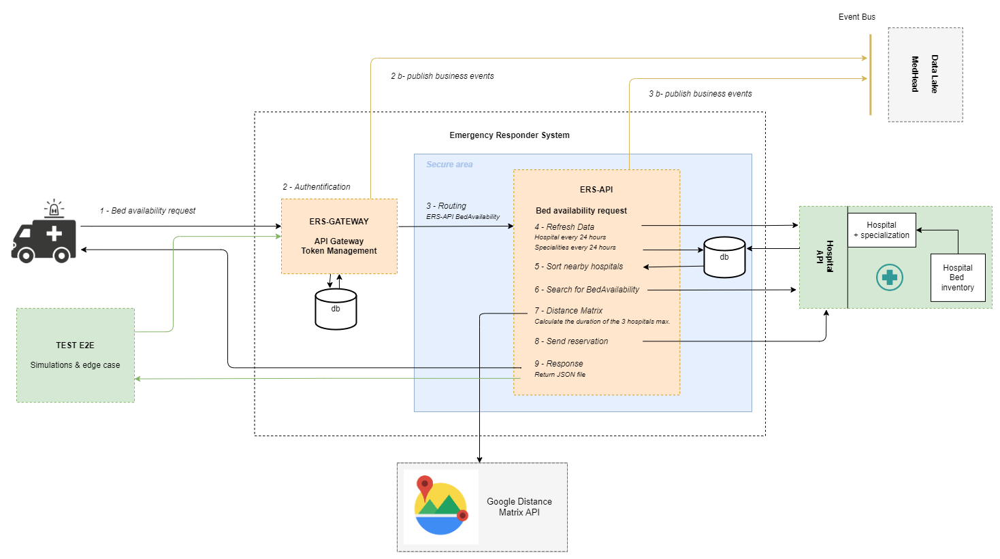

# MedHead Code Repository

La plateforme MedHead est détenue conjointement et développée par un consortium de 4 groupes médicaux afin de consolider les apprentissages et les ressources partagés et de développer une norme médicale qui optimise les soins aux patients et les interventions d'urgence.

# Architecture

## [Architecture métier](./docs/Architecture_metier.md)

## [Environnement Docker](./docs/Docker_Environnement.md)

## [Pipeline CI/CD & AWS Architecture](./docs/AWS_Architecture.md)

Architecture métier
● Architecture des données et de l'information
● Architecture de la sécurité
● Architecture technologique
PLAN DE RECOUVREMENT

Bus d'événements et lac de données Tous les services devront publier les
principaux événements métier sur un bus d'événements commun, ce qui
entraînera également l’agrégation des événements dans un lac de
données à accès optimisé. Le lac de données est destiné à permettre aux
applications de reconstruire les magasins de données en fonction de
l'historique des applications. Le lac de données est destiné à assister les
systèmes en temps réel (entre autres) afin qu’ils fournissent des
comportements réactifs au changement.

