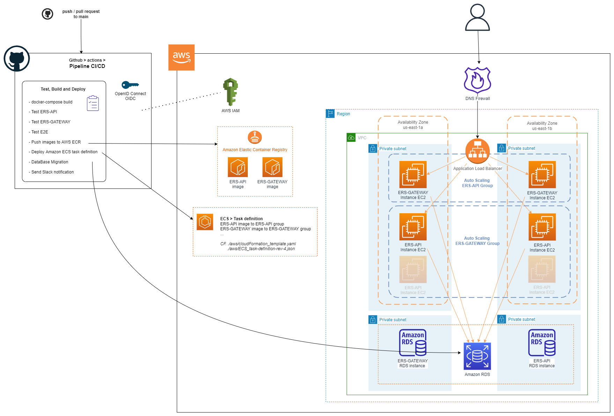

# MedHead Code Repository

La plateforme MedHead est détenue conjointement et développée par un consortium de 4 groupes médicaux afin de consolider les apprentissages et les ressources partagés et de développer une norme médicale qui optimise les soins aux patients et les interventions d'urgence.

# Architecture

## [Architecture métier](./docs/Architecture_metier.md)

## [Environnement Docker](./docs/Environnement_Docker.md)

## [CI/CD & AWS Architecture](./docs/Architecture_AWS.md)

