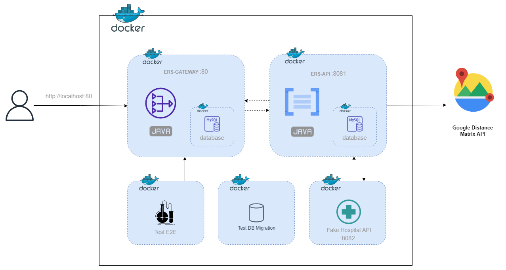

# MedHead Code Repository

La plateforme MedHead est détenue conjointement et développée par un consortium de 4 groupes médicaux afin de consolider les apprentissages et les ressources partagés et de développer une norme médicale qui optimise les soins aux patients et les interventions d'urgence.

# Architecture

## [Architecture métier](./docs/Architecture_metier.md)

## [Environnement Docker](./docs/Docker_Environnement.md)

## [AWS Architecture](./docs/AWS_Architecture.md)

## [Pipeline CI/CD with GitHub Actions](./docs/AWS_Architecture.md)

● Architecture des données et de l'information
● Architecture de la sécurité

PLAN DE RECOUVREMENT
