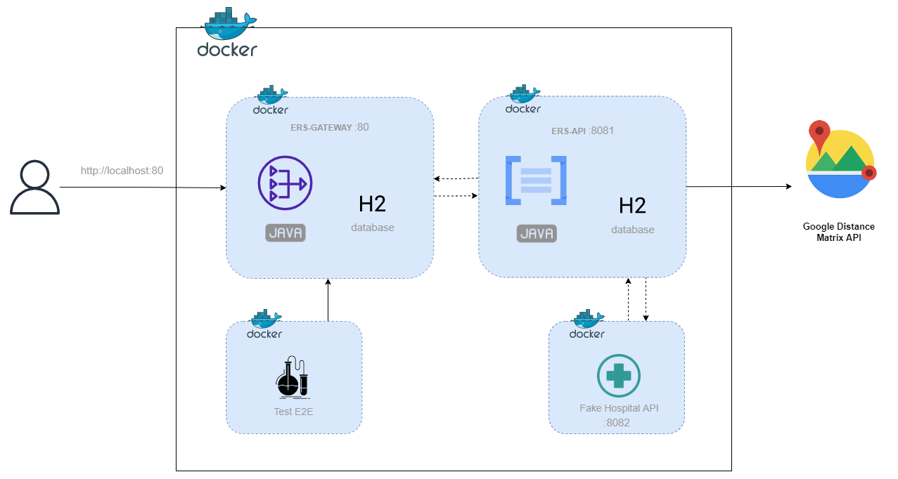

# MedHead Code Repository

La plateforme MedHead est détenue conjointement et développée par un consortium de 4 groupes médicaux afin de consolider les apprentissages et les ressources partagés et de développer une norme médicale qui optimise les soins aux patients et les interventions d'urgence.

# Architecture

## [Architecture métier](./docs/Architecture_metier.md)

## [Environnement Docker](./docs/Environnement_Docker.md)

## Environnement AWS
CF. [./aws/readme.md](./aws/readme.md)

Grâce à **AWS CloudFormation** et son fichier de configuration [template.yaml](./aws/cloudformation/template.yaml) et ses [scripts](./aws/scripts/), il devient facile de créer toutes les ressources. 

Cette pile créée les ressources suivantes :
- Une instance Amazon EC2 Linux avec le serveur Tomcat et l'agent CodeDeploy installés
- Groupe d'autoscaling avec équilibreur de charge
- Nom de l'application CodeDeploy et groupe de déploiement
- Compartiment Amazon S3 pour stocker les artefacts de build
- Fournisseur d'identité OIDC de gestion des identités et des accès (IAM)
- Profil d'instance pour Amazon EC2
- Rôle de service pour CodeDeploy
- Groupes de sécurité pour ALB et Amazon EC2

## CI/CD GitHub Actions
CF. [./aws/readme.md](./aws/readme.md)

### Cycle de vie

- Clone / Fork repository
- Create branch
- Perform changes
- Commit
    - GitHub Action : Build Java with Maven 
- Create a Pull Request
    - Pull Request Validation and merge into "main" branch 
    - GitHub Action : Deploy to AWS

