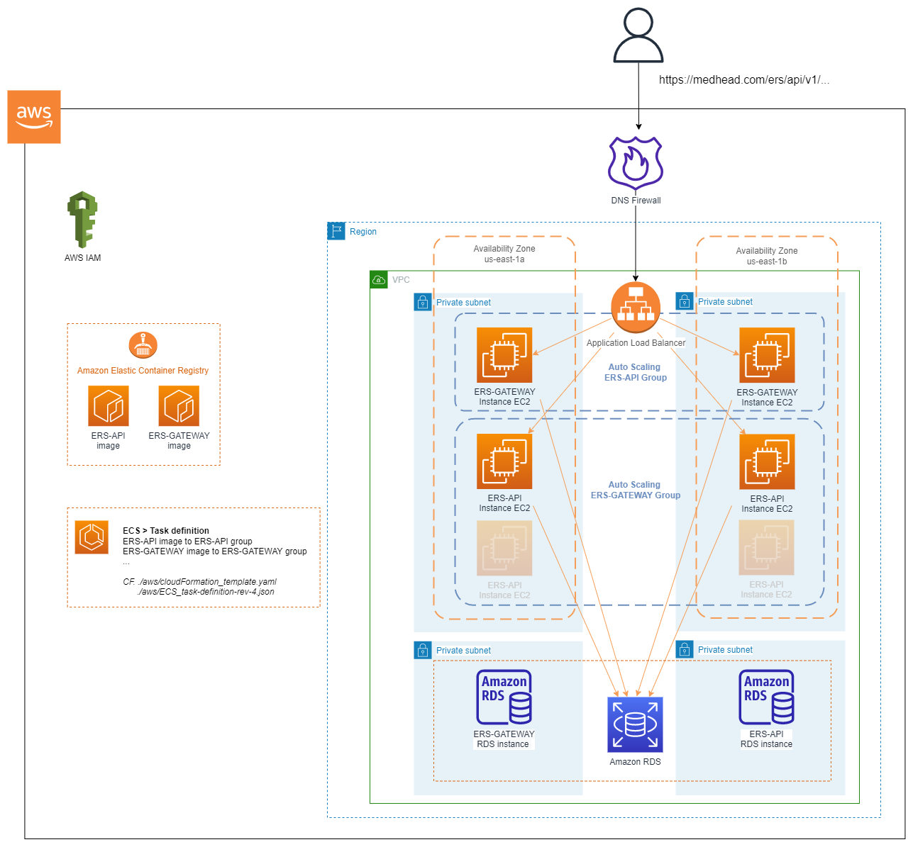

# AWS Architecture

## Vue d'ensemble de la solution

La solution utilise les services suivants :

- [GitHub Actions](https://docs.github.com/en/actions) : Outil d'orchestration de workflow qui hébergera la Pipeline ([pipeline.yml](../.github/workflows/pipeline.yml)).
- [AWS Auto Scaling](https://aws.amazon.com/ec2/autoscaling/) : Service AWS pour aider à maintenir la disponibilité et l'élasticité des applications en ajoutant ou supprimant automatiquement des instances EC2.
- [Amazon ECR](https://aws.amazon.com/fr/ecr/) : Registre de conteneurs entièrement géré qui offre un hébergement haute performance, afin que vous puissiez déployer de manière fiable des images d'applications et des artefacts n'importe où.
- [Amazon EC2](https://docs.aws.amazon.com/ec2/index.html?nc2=h_ql_doc_ec2#amazon-ec2) : Serveur de calcul pour le déploiement de l'application.
- [Amazon ECS](https://aws.amazon.com/fr/ecs/) : Service d'orchestration de conteneurs entièrement géré qui vous permet de déployer, de gérer et de mettre à l'échelle des applications conteneurisées en toute simplicité.
- [AWS CloudFormation](https://aws.amazon.com/cloudformation/) : Service AWS d'infrastructure en tant que code (IaC) utilisé pour faire tourner l'infrastructure initiale côté AWS.
- [IAM OIDC identity provider](https://docs.aws.amazon.com/IAM/latest/UserGuide/id_roles_providers_create_oidc.html) : Service d'authentification fédérée pour établir la confiance entre GitHub et AWS afin de permettre aux actions GitHub de se déployer sur AWS sans conserver les secrets et les informations d'identification AWS.
- [Amazon RDS](https://aws.amazon.com/fr/rds) : Ensemble de services gérés qui facilite la configuration, l'utilisation et la mise à l'échelle des bases de données dans le cloud. Moteur utiisé : MySQL.

Grâce à **AWS CloudFormation** et son fichier de configuration [cloudFormation_template.yaml](../aws/cloudFormation_template.yaml) et ses [scripts](../aws/scripts/), il devient facile de créer toutes les ressources. 

Lors du déployement c'est le fichier [task-definition.json](../aws/) qui entre en jeu et positionne les images contenues sur l'ECR dans les bons compartiments et groupe d'auto-scaling.

 
 

## Veuillez consulter 
- [AWS_cloudFormation_install.md](./AWS_cloudFormation_install.md)
- [AWS_cleanup.md](./AWS_cleanup.md)
- [AWS_config.md](../aws/AWS_config.md)
- [cloudFormation_template.yaml](../aws/cloudFormation_template.yaml)
- [pipeline.yml](../.github/workflows/pipeline.yml)

