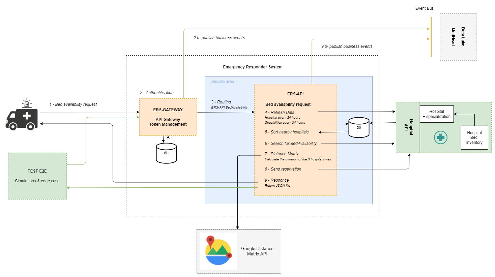

# Architecture métier

## Comportement
Pour reprendre l'exemple décrit dans le document [Hypothèse de validation de principe](https://github.com/GitSDamien/OC_11_Architectural/blob/master/artefacts/architecture/hypothesis-emergency-responder), du repository [GitSDamien/OC_11_Architectural](https://github.com/GitSDamien/OC_11_Architectural) :


Par exemple, SUPPOSONS trois hôpitaux, comme suit :

| Hôpital | Lits disponibles | Spécialisations |
|:-------|:-------:|:-------|
| Hôpital Fred Brooks | 2 | Cardiologie, Immunologie|
| Hôpital Julia Crusher | 0 | Cardiologie | 
| Hôpital Beverly Bashir | 5 | Immunologie, neuropathologie diagnostique |

* ET un patient nécessitant des soins en cardiologie.
* QUAND vous demandez des soins en cardiologie ET que l'urgence est localisée près de l'hôpital Fred Brooks
* ALORS l'hôpital Fred Brooks devrait être proposé
* ET un événement devrait être publié pour réserver un lit.

<br>
<br>

## Mise en œuvre



1. Requête de demande de disponibilité de lit, selon :
    - latitude / longitude
    - id(s) des spécialités NHS
```
curl -H "Content-Type: application/json"
    -H "gatewayKey: 343C-ED0B-4137-B27E" 
    -X POST -d '{
        "latitude": 43.657554510261534,
        "longitude": 7.049383456590217,
        "specs": [21]
    }' 
https://medhead/api/v1/BedAvailability
```

2. Authentification par token encapsulé dans le header
3. Routage vers le microservice 
    - ERS-API :8081 /BedAvailability
4. Raifraichir les données toutes les 24h pour les tables :
    - Hospital
    - Specialities
5. Récupère la liste des hopitaux et les trie par distance (à vol d'oiseaux)
6. Demande de dispo de lit à l'API Hospital
7. Demande de calcul de la distance et du temps de trajet avec Google Distance Matrix
    - (3 est le nombre max d'hopitaux pour les étapes 6. et 7.)
8. Envoyer la réservation de lit à l'API Hospital
9. Répondre à l'utilisateur (JSON file) l'hopital choisi avec son temps de parcours et ses kilomètres.

```
{
    "id": 6,
    "name": "Hôpital Fred Brooks",
    "bed": 5,
    "latitude": 43.663514,
    "longitude": 6.923253,
    "distance": 14368.0,
    "distancestr": "14.4 km",
    "duration": "25 mins"
}
```


<br>
<br>

## Projets liés
- [ERS-API](../ers-api/) : Logique métier
- [ERS-GATEWAY](../ers-gateway/) : Authentification & routage
