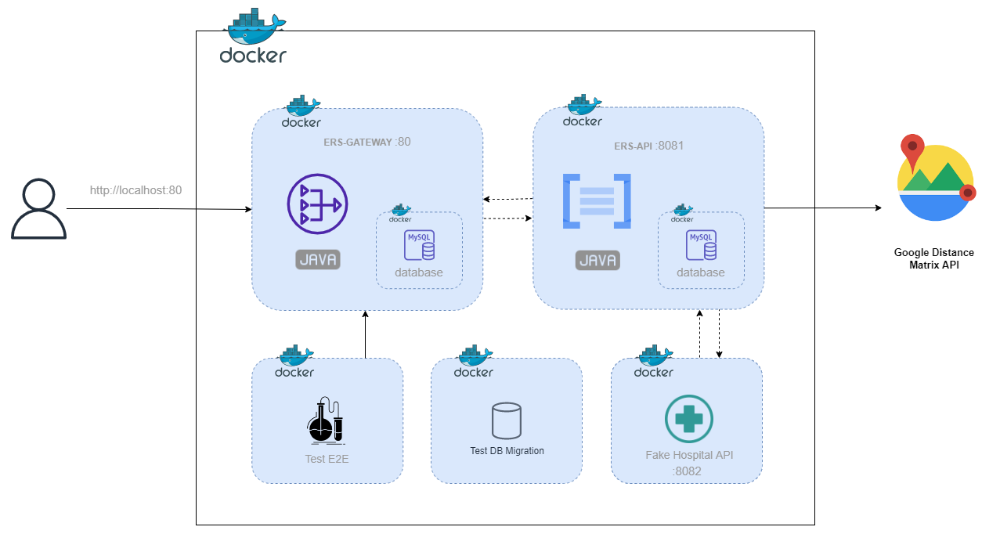

# Environnement Docker

Tout notre environnement de développement est contenu dans le fichier [docker-compose.yml](../docker-compose.yml). Il est essentiel lors de notre CI/CD. Les tests unitaires et d'intégrations sont lancés au build des images. Après le démarrage de l'environnement, les tests End2End peuvent être lancés à n'importe quel moment. Celui-ci se fait automatiquement au merge avec la branche "main".

## Démarrer l'environnement
    docker-compose up -d --build

## Test End 2 End
    docker exec test-e2e mvn -B test
    

 
 

## Projets liés
- [ERS-API](../ers-api/) : Logique métier
- [ERS-GATEWAY](../ers-gateway/) : Authentification & routage
- [FAKE-API-HOSPITAL](../fake-api-hospital/) : Simulation de l'API externe Hospital
- [TEST-E2E](../test-e2e/) : Test du parcours complet de l'utilisateur