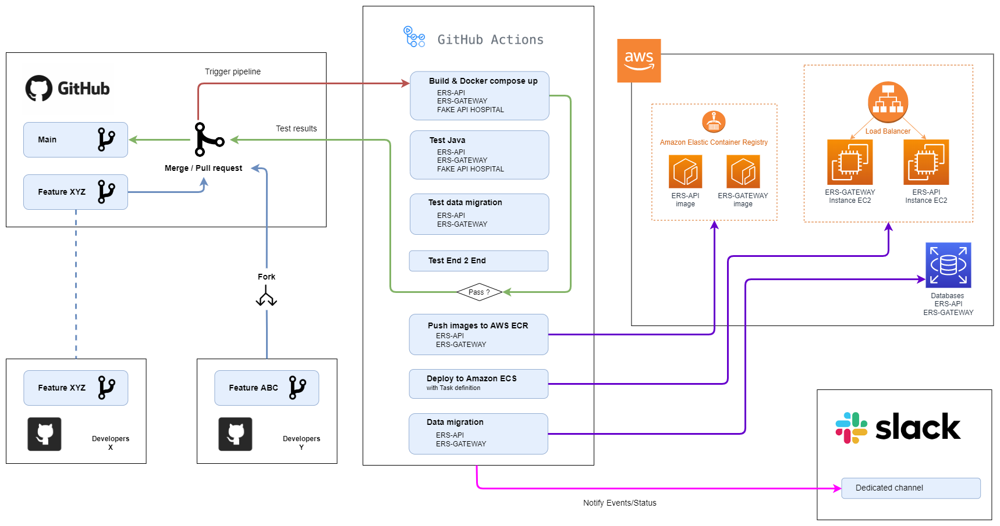

# Pipeline CI/CD avec GitHub Actions

## GitHub
Seul la branche "main" actionne la pipeline Ci/CD, nous pouvons donc avoir d'autres branches complement indépendantes.
Il est possible faire un "fork" sur le projet pour avoir le template du projet.

## GitHub Actions

1. Lancement du docker-compose up --build
    - Build de toutes les images en éxecutant les tests unitaire et d'implémentation
2. Extrait les rapports de test du projet ERS-API
3. Extrait les rapports de test du projet ERS-GATEWAY
4. Exécute le test de migration des données
5. Exécute les test End2End
    - Extrait les rapports de test
6. Changement des datasources et rebuild des images (ERS-API & ERS-GATEWAY)
7. Envoi des images à Amazon ECR (ERS-API & ERS-GATEWAY)
8. Déployement à partir d'Amazon ECS task definition
9. Migration des bases de données sur Amazon RDS
10. Envoi de notifications sur un canal Slack

 

Retrouver l'intégralité de chaque workflow passés dans la pipeline sur https://github.com/GitSDamien/test2/actions

Accèder aux rapports de test

 
 

## Veuillez consulter 
- [pipeline.yml](../.github/workflows/pipeline.yml)

